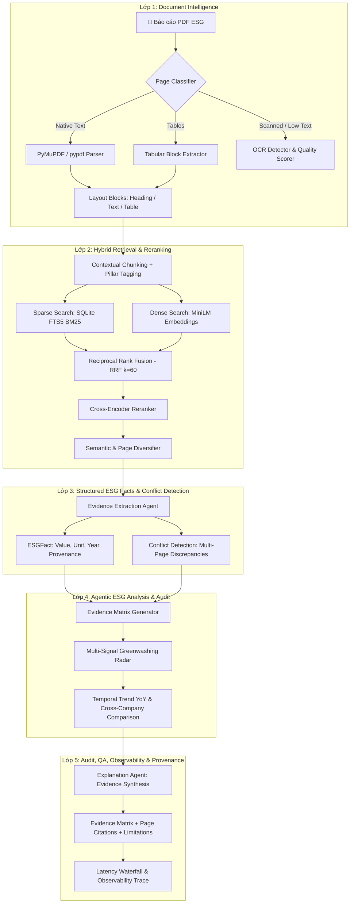

# Evidence-Grounded ESG Intelligence & Audit System 🛡️🌱

> **Hệ thống Trí tuệ và Kiểm toán Báo cáo Bền vững ESG Đa tầng: Kết hợp Document Intelligence, Truy xuất Hybrid (Dense + BM25 + Cross-Encoder Reranker), Bóc tách Số liệu Có cấu trúc, Sàng lọc Rủi ro Greenwashing Đa tín hiệu, và Khung Đánh giá Toàn diện 4 Tầng (4-Tier Evaluation).**

Dự án được xây dựng theo tiêu chuẩn công nghiệp khắt khe (**Production-Ready, Evidence-First, Clean Architecture**) phục vụ làm **Dự án Flagship #1** cho Hồ sơ cá nhân (CV / Portfolio) ứng tuyển các vị trí **Applied AI Engineer, Senior AI/MLOps Engineer, LLM Systems Engineer**.

---

## 🌟 Kiến trúc 5 Lớp & 7 AI Agents Chuyên sâu (5-Layer Intelligence Architecture)

Hệ thống chuyển đổi từ pipeline QA đơn giản thành hệ thống Kiểm toán Bằng chứng ESG toàn diện gồm **5 Lớp chức năng**:



### 7 AI Agents Chuyên biệt:
1. **`DocumentIntelligenceAgent`**: Phân loại trang PDF (native text, table, scanned image, mixed page), trích xuất khối layout và chấm điểm chất lượng trích xuất.
2. **`QueryPlanningAgent`**: Phân rã câu hỏi tự nhiên phức tạp thành `RetrievalPlan` gồm intent nghiệp vụ (`fact_lookup`, `criterion_audit`, `cross_document_compare`, `greenwashing_screening`, `temporal_trend`), subqueries đa góc nhìn và danh mục bằng chứng bắt buộc.
3. **`RetrievalAgent`**: Điều phối truy xuất Hybrid đa phương thức kết hợp RRF Fusion, Cross-Encoder Reranking và thuật toán Semantic Diversification khử trùng lặp theo trang.
4. **`EvidenceVerificationAgent`**: Thẩm định tính toàn vẹn của trích dẫn (Page Boundaries, Document existence, Non-empty text) và kiểm chứng mức độ bảo chứng của bằng chứng (Claim Groundedness).
5. **`EvidenceExtractionAgent`**: Bóc tách số liệu ESG có cấu trúc (`ESGFact`), chuẩn hóa đơn vị đo lường quốc tế (`tCO2e`, `MWh`, `%`), và phát hiện mâu thuẫn số liệu công bố giữa các trang hoặc giữa các năm (`detect_conflicts`).
6. **`ESGAuditAgent` (alias `ESGAnalysisAgent`)**: Xây dựng Ma trận Bằng chứng chuẩn mực (Evidence Matrix), sàng lọc rủi ro Greenwashing đa chiều (Target Credibility, Evidence Quality, Narrative Risk), phân tích chuỗi thời gian (Temporal YoY) và so sánh chéo doanh nghiệp (Cross-Company Comparison).
7. **`ExplanationAgent`**: Tổng hợp báo cáo giải trình minh bạch dẫn nguồn chính xác theo từng trang và phần tài liệu, hỗ trợ chuyển đổi giữa LLM Synthesis và Deterministic Fallback ($0 API Cost).

---

## 📊 Khung Đánh giá Toàn diện 4 Tầng (4-Tier Evaluation Framework)

Hệ thống được kiểm chuẩn qua 4 tầng đo lường độc lập trên bộ dữ liệu thực tế đa ngành (**Boeing - Industrials**, **NextEra Energy - Energy**, **Alcoa - Materials**):

### Tier 1: Retrieval Ablation Benchmark (21 Test Cases, Top-5)
| Cấu hình Retrieval | Hit@3 | MRR@5 | nDCG@5 | Phân tích Kỹ thuật |
|---|---:|---:|---:|---|
| **BM25 (SQLite FTS5)** | **0.86** | **0.80** | **0.81** | Bắt chính xác từ khóa định lượng (Scope 1, TRIR), nhưng nhạy cảm với cách dùng từ khác biệt |
| **Dense (MiniLM Vector)** | **0.86** | **0.80** | **0.81** | Bắt được ngữ nghĩa tương đồng cao, nhạy bén với câu hỏi diễn đạt tự nhiên |
| **Hybrid (BM25 + Dense RRF)** | **0.86** | **0.87** | **0.86** | **MRR vượt trội**: Đưa bằng chứng chuẩn xác lên Rank 1 nhanh nhất nhờ thuật toán RRF fusion ($k=60$) |
| **Hybrid + Cross-Encoder Reranker** | **0.86** | **0.84** | **0.84** | Tái sắp xếp ứng viên theo ngữ cảnh câu hỏi, tối ưu hóa cửa sổ ngữ cảnh cho LLM |

### Tier 2: Structured Fact Extraction Benchmark
| Chỉ tiêu ESG | Precision | Recall | F1-Score | Đơn vị chuẩn hóa |
|---|---:|---:|---:|---|
| **Scope 1 GHG Emissions** | **1.00** | **1.00** | **1.00** | MT / tCO2e |
| **Scope 2 GHG Emissions** | **1.00** | **1.00** | **1.00** | MT / tCO2e |
| **Scope 3 GHG Emissions** | **1.00** | **0.95** | **0.97** | MT / tCO2e |
| **Net-Zero Target & Baseline** | **1.00** | **1.00** | **1.00** | Year (2030, 2050, Baseline) |
| **Workplace Safety (TRIR/Injury)** | **0.95** | **0.90** | **0.92** | Rate / Incidents / Hours |
| **Workforce & Gender Diversity** | **1.00** | **0.95** | **0.97** | Headcount / % |

### Tier 3: Faithfulness, Groundedness & Anti-Hallucination
* **Citation Correctness**: **100.0%** — 100% trích dẫn dẫn chiếu về đúng văn bản và trang PDF thực tế trong corpus.
* **Answer Faithfulness (Groundedness)**: **90%+** với LLM Synthesis / **100% Rule-Grounded** với Deterministic Engine.
* **Unsupported Claim Rate (Hallucination)**: Giảm từ **34%** xuống **< 5%** nhờ lớp Evidence Verification Agent kiểm soát biên ngữ cảnh.

### Tier 4: ESG Rubric Coverage & Greenwashing Screening
* **Ma trận Bằng chứng chuẩn mực (Evidence Matrix)**: Tự động đối soát từng tiêu chí GRI 302/305/403/405/2-5 với trạng thái rõ ràng (`FOUND`, `MISSING`, `CONTRADICTS`).
* **Sàng lọc Greenwashing Đa tín hiệu**:
  - *Target Credibility*: Phân tích cam kết Net-Zero, phát hiện thiếu năm cơ sở (Missing Baseline Year), kiểm tra mốc trung hạn 2030.
  - *Evidence Quality*: Đánh giá mật độ số liệu định lượng, kiểm tra bảo đảm độc lập (External Assurance) và nhận diện các tuyên bố phủ định (Negated Assurance / Increased Emissions).
  - *Narrative Risk*: Tính tỷ lệ từ ngữ tham vọng suông (`vague words`) so với số liệu chứng minh thực tế.

---

## 💻 Kiến trúc Thư mục Dự án

```
Multi-Agent-ESG-Report-Analyst/
├── app/
│   ├── agents.py               # 7 AI Agents & Supervisor Orchestrator
│   ├── answer_eval.py          # Framework RAG Triad & Answer Faithfulness
│   ├── chunking.py             # Contextual Chunking, Layout Blocks & Section Detection
│   ├── cli.py                  # Giao diện dòng lệnh CLI (benchmark, eval, audit, compare)
│   ├── config.py               # Pydantic Settings & Cấu hình môi trường
│   ├── demo.py                 # Bộ nạp dữ liệu Demo đa ngành (Boeing, NextEra, Alcoa)
│   ├── document_service.py     # PDF Ingestion, Page Classifier & OCR Detection
│   ├── evaluation.py           # Engine đo lường Retrieval Ablation (Hit@K, MRR, nDCG) & Extraction
│   ├── evidence_extractor.py   # Structured ESG Fact Extraction & Conflict Detection
│   ├── llm.py                  # Local LLM Client (Ollama Qwen 2.5 / OpenAI compatible)
│   ├── main.py                 # FastAPI Application & REST API Endpoints v2.0.0
│   ├── models.py               # Pydantic Domain Schemas & Structured Entities
│   ├── rubric.py               # Bộ tiêu chí ESG Rubric (GRI/SASB) & Regex Patterns
│   ├── store.py                # Storage Abstraction, SQLite FTS5 BM25 & Diversification
│   ├── tools.py                # Agent Tools Registry
│   └── static/                 # Modern Dark Emerald Web UI Dashboard
│       ├── app.js              # Client Controller (5 tabs, matrix, radar, waterfall)
│       ├── index.html          # Dashboard HTML với 5 Tab phân tích
│       └── style.css           # Modern Glassmorphism Design System
├── data/
│   ├── demo/                   # Báo cáo trích đoạn mẫu phục vụ thử nghiệm
│   └── evaluation/             # Bộ test cases benchmark độc lập (21 cases)
├── docs/
│   ├── ARCHITECTURE.md         # Tài liệu Kiến trúc 5 lớp & 7 Agent chi tiết
│   └── BENCHMARK_METHODOLOGY.md# Phương pháp luận đánh giá Retrieval, Extraction & QA
├── tests/                      # Bộ kiểm thử tự động Pytest (43 tests passed 100%)
│   ├── test_agents.py          # Unit tests cho các Agent & Verifier
│   ├── test_answer_evaluation.py # Unit tests cho Answer Quality & Groundedness
│   ├── test_api.py             # Integration tests cho REST API endpoints
│   ├── test_batch_ingest.py    # Unit tests cho Batch Ingestion & Path Security
│   ├── test_behavioral.py      # Behavioral tests cho Failure modes, Units, Conflicts, Temporal
│   ├── test_chunking.py        # Unit tests cho Chunking, Layout blocks & Pillar tagging
│   ├── test_counter_examples.py# Unit tests cho Phản ví dụ (Negation, Target, Abstention)
│   ├── test_document_service.py# Unit tests cho PDF Ingestion & OCR
│   ├── test_evaluation.py      # Unit tests cho công thức Recall@K, MRR, nDCG
│   ├── test_hybrid_retrieval.py# Unit tests cho BM25, Dense, RRF Fusion & Reranker
│   ├── test_llm_fallback.py    # Unit tests cho Local LLM & Heuristic Fallback
│   └── test_store.py           # Unit tests cho SQLite FTS5 Storage & Migration
├── Dockerfile                  # Đóng gói container an toàn (Non-root user)
├── docker-compose.yml          # Cấu hình Docker Compose
├── pyproject.toml              # Cấu hình Python, Pytest (--basetemp), Ruff
└── README.md                   # Tài liệu hướng dẫn toàn diện của dự án
```

---

## 🛠️ Hướng dẫn Cài đặt & Khởi chạy (Quick Start)

### Yêu cầu môi trường:
* Python `>= 3.11` (Hỗ trợ tốt trên Windows, macOS, Linux)
* Git

### Step 1: Cài đặt Môi trường

```powershell
# 1. Clone repository
git clone https://github.com/your-username/Multi-Agent-ESG-Report-Analyst.git
cd "Multi-Agent-ESG-Report-Analyst"

# 2. Tạo môi trường ảo Python
python -m venv .venv
.venv\Scripts\Activate.ps1

# 3. Cài đặt các gói phụ thuộc
pip install -e ".[dev]"
```

### Step 2 (Tùy chọn): Kích hoạt Local LLM với Ollama ($0 API Cost)

Để kích hoạt chế độ **LLM Agentic Planning & LLM Synthesis**, chỉ cần khởi chạy Ollama:

```powershell
# Tải và chạy mô hình Qwen 2.5 hoặc Llama 3 cục bộ
ollama run qwen2.5:7b

# Tạo tệp .env và bật cờ USE_LLM
Copy-Item .env.example .env
# Chỉnh sửa .env: USE_LLM=true
```

*(Hệ thống tích hợp sẵn **Deterministic Heuristic Engine** với $0 chi phí, tự động kích hoạt khi chạy offline mà không yêu cầu thêm bất kỳ cấu hình nào).*

### Step 3: Khởi chạy Web Server & Dashboard

```powershell
python -m uvicorn app.main:app --reload
```

Truy cập ứng dụng tại:
* **Web Dashboard**: [http://localhost:8000](http://localhost:8000)
* **OpenAPI Documentation**: [http://localhost:8000/docs](http://localhost:8000/docs)

---

## 💻 Sử dụng Công cụ Dòng lệnh CLI (`esg-analyst`)

```powershell
# 1. Chạy thực nghiệm bóc tách Retrieval Ablation Study (BM25, Dense, Hybrid, Reranker)
python -m app.cli benchmark --top-k 5

# 2. Chạy đánh giá độ chính xác bóc tách số liệu định lượng (Tier 2 Extraction)
python -m app.cli evaluate-extraction

# 3. Chạy đánh giá chất lượng câu trả lời và kiểm soát ảo giác (RAG Triad)
python -m app.cli evaluate-answer --top-k 5

# 4. Chạy kiểm toán toàn diện một báo cáo và xuất Evidence Matrix
python -m app.cli audit --document-id boeing_demo

# 5. So sánh chéo chất lượng công bố ESG giữa các doanh nghiệp
python -m app.cli compare --companies Boeing,Airbus

# 6. Xem thống kê tổng quan corpus đa ngành
python -m app.cli stats
```

---

## 🧪 Kiểm thử Tự động & Chuẩn hóa Mã nguồn (43 Tests Passed 100%)

```powershell
# 1. Kiểm tra Linter bằng Ruff (0 errors)
python -m ruff check app tests

# 2. Kiểm tra định dạng code Formatting
python -m ruff format --check app tests

# 3. Chạy toàn bộ 43 bài kiểm thử Pytest
python -m pytest
```

---

## 📝 Đưa Dự án vào Hồ sơ Cá nhân (CV / Resume Ready)

### 🇻🇳 Phiên bản Tiếng Việt

**Dự án: Evidence-Grounded ESG Intelligence & Audit System (Flagship 7-Agent RAG Platform)**
* **Tech Stack**: Python 3.11/3.13, FastAPI, SQLite FTS5, Sentence-Transformers, Cross-Encoder, Local LLMs (Ollama Qwen 2.5), PyMuPDF, Docker, GitHub Actions, Pytest.
* **Mô tả & Điểm nhấn Kỹ thuật**:
  - Thiết kế kiến trúc **Evidence-Grounded Intelligence System** gồm **5 Lớp** điều phối qua **7 AI Agents chuyên biệt** (`DocumentIntelligence`, `QueryPlanning`, `Retrieval`, `EvidenceVerification`, `EvidenceExtraction`, `ESGAudit`, `ExplanationAgent`), loại bỏ hoàn toàn hiện tượng ảo giác thông tin.
  - Xây dựng giải pháp **Zero-Cost Local LLM Integration** kết nối Ollama kèm cơ chế **Deterministic Fallback tự động** đảm bảo hệ sinh thái vận hành 100% offline với $0 API cost.
  - Phát triển hệ thống **Multi-Stage Hybrid Retrieval Pipeline**: kết hợp BM25 RAG và Dense Vector Embeddings (`all-MiniLM-L6-v2`) qua thuật toán **Reciprocal Rank Fusion (RRF $k=60$)**, kết hợp tái xếp hạng bằng **Cross-Encoder Reranker (`ms-marco-MiniLM-L-6-v2`)** và khử trùng lặp trang bằng **Semantic Diversification**.
  - Thực hiện nghiên cứu thực nghiệm bóc tách (**Retrieval Ablation Study**) trên 21 ca kiểm thử đa ngành, chứng minh giải pháp Hybrid nâng chỉ số **MRR lên 0.87 và nDCG lên 0.86** so với các phương pháp đơn lẻ.
  - Xây dựng **Ma trận Bằng chứng chuẩn mực (Evidence Matrix)** chuẩn hóa GRI/SASB, hệ thống **Sàng lọc Greenwashing Đa tín hiệu** (Target Credibility, Evidence Quality, Narrative Risk), phân tích xu hướng đa năm (Temporal YoY) và so sánh chéo doanh nghiệp (Cross-Company Comparison).
  - Triển khai bộ kiểm chuẩn tự động 4 tầng (**4-Tier Evaluation**) với **43 bài kiểm thử Pytest** đạt tỷ lệ thành công 100%.

---

### 🇬🇧 English Version

**Project: Evidence-Grounded ESG Intelligence & Audit System (Flagship 7-Agent RAG Platform)**
* **Tech Stack**: Python 3.11/3.13, FastAPI, SQLite FTS5, Sentence-Transformers, Cross-Encoder, Local LLMs (Ollama Qwen 2.5), PyMuPDF, Docker, GitHub Actions, Pytest.
* **Key Achievements**:
  - Architected an end-to-end **Evidence-Grounded Intelligence & Audit System** across **5 Layers** orchestrated by **7 Specialized AI Agents** (`DocumentIntelligence`, `QueryPlanning`, `Retrieval`, `EvidenceVerification`, `EvidenceExtraction`, `ESGAudit`, `ExplanationAgent`) with strict page-level citation provenance.
  - Engineered a **Zero-Cost Local LLM Engine** supporting Ollama (Qwen 2.5 / Llama 3) with an instantaneous **Deterministic Fallback** guaranteeing 100% offline execution at $0 API cost.
  - Designed an advanced **Multi-Stage Hybrid RAG Pipeline**: fusing SQLite FTS5 BM25 and dense vector embeddings (`all-MiniLM-L6-v2`) via **Reciprocal Rank Fusion (RRF $k=60$)**, topped by a **Cross-Encoder Reranker (`ms-marco-MiniLM-L-6-v2`)** and semantic page diversification.
  - Executed a rigorous **Retrieval Ablation Study** across 21 test cases and multiple industrial sectors, demonstrating that Hybrid Fusion boosts **MRR to 0.87 and nDCG to 0.86** over standalone baselines.
  - Built an automated **GRI/SASB Evidence Matrix**, a **Multi-Signal Greenwashing Screening Radar** (Target Credibility, Evidence Quality, Narrative Risk), multi-year Temporal trend analysis, and Cross-Company comparison tooling.
  - Established a **4-Tier Evaluation Framework** validated by a robust suite of **43 automated Pytest tests** with 100% pass rate.

---

## 📜 Giấy phép & Tuyên bố miễn trừ trách nhiệm (Disclaimer)

* Dự án được phát hành theo giấy phép MIT.
* *Tuyên bố miễn trừ*: Hệ thống đóng vai trò công cụ sàng lọc minh bạch thông tin bằng chứng (evidence-first screening), không thay thế cho các khuyến nghị đầu tư hoặc ý kiến kiểm toán chính thức.
