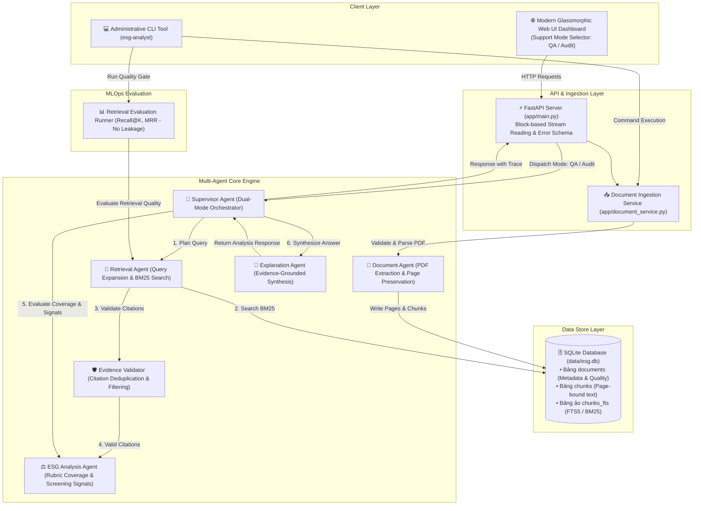

# Multi-Agent ESG Report Analyst 🛡️🌱

Nền tảng prototype hỗ trợ truy xuất bằng chứng trong báo cáo bền vững (ESG), bảo toàn citation theo trang PDF gốc, đánh giá mức độ công bố thông tin (Disclosure Coverage) bằng rubric giải thích được và sàng lọc các tín hiệu cần chuyên gia kiểm tra.

Dự án được thiết kế chuẩn mực theo tiêu chí **Clean Code, Kiến trúc Modular, Đánh giá chất lượng độc lập (Evaluation Framework)** phục vụ cho **Hồ sơ cá nhân (CV / Portfolio)** ứng tuyển các vị trí **Applied AI Engineer, AI Engineer (Cloud & MLOps), Backend AI Developer**.

---

## 🌟 Điểm nổi bật & Giá trị Kỹ thuật (Technical Highlights)

* **Kiến trúc Dual-Mode Multi-Agent ($0 API Cost)**: Hệ thống cung cấp hai chế độ làm việc độc lập: **Evidence Q&A** (hỏi đáp theo trang) và **Full ESG Audit** (đánh giá mức độ bao phủ tiêu chí chuẩn mực E/S/G).
* **Page-Preserved Evidence Retrieval**: Mọi kết luận truy xuất đều được dẫn chiếu về đúng tệp và **số trang PDF gốc** (`document_id`, `page`, `excerpt`), minh bạch hóa căn cứ phân tích.
* **SQLite FTS5 / BM25 Search Engine**: Thuật toán xếp hạng tìm kiếm toàn văn BM25 trên bảng ảo SQLite FTS5 giúp truy xuất các đoạn văn bản chứa bằng chứng định lượng.
* **Explainable Rubric & Screening Signals**: Đánh giá mức độ công bố minh bạch `disclosure_coverage = (số tiêu chí tìm thấy / tổng tiêu chí) * 100`. Sàng lọc tín hiệu nghi vấn (thiếu baseline year, thiếu external assurance, mục tiêu suông không số liệu).
* **Retrieval Evaluation & Quality Gates**: Khung đo lường `Recall@K`, `MRR` và `Precision@K` trên tập Ground Truth độc lập (không bị leakage document_id), đóng vai trò Quality Gate tự động kiểm tra regression trong CI/CD.
* **Modern Glassmorphic Web UI**: Dashboard Dark Emerald trực quan hóa luồng thực thi của từng Agent, hiển thị thẻ tiêu chí E/S/G và danh sách Citation trang PDF nguồn.

---

## 📊 Trạng thái Hệ thống & Evaluation Baseline

| Hạng mục | Trạng thái | Ghi chú |
|---|---|---|
| **PDF Ingestion & Magic Bytes Validation** | 🟢 Hoàn thành | Kiểm tra `%PDF-`, SHA-256 content hash, giới hạn 75MB |
| **Page-Preserved Chunking Engine** | 🟢 Hoàn thành | Chia chunk có overlap, heading-aware, giữ nguyên số trang gốc |
| **SQLite FTS5 / BM25 Search** | 🟢 Hoàn thành | Xếp hạng BM25 RAG kết hợp Lexical search fallback |
| **Dual-Mode Multi-Agent Engine** | 🟢 Hoàn thành | Phân tách hai luồng Evidence Q&A và Full ESG Audit |
| **Rubric & Screening Signals** | 🟢 Hoàn thành | Đánh giá `disclosure_coverage` và phát hiện tín hiệu cần kiểm tra |
| **Retrieval Evaluation & Quality Gates** | 🟢 Hoàn thành | CLI đánh giá `Recall@K`, `MRR` không bị data leakage |
| **Modern Glassmorphism Web UI** | 🟢 Hoàn thành | Dashboard Dark Emerald, Visual Agent Trace, Mode Toggle |
| **Docker & GitHub Actions CI/CD** | 🟢 Hoàn thành | Docker image non-root, Ruff, Pytest và CLI evaluation trong CI |

### 📈 Baseline Evaluation (Boeing 2025 Excerpt Sample)

| Chỉ số MLOps Metric | Kết quả Baseline | Mô tả ý nghĩa |
|---|---:|---|
| **Recall@5** | **1,00** | 100% trang chứa bằng chứng kỳ vọng được tìm thấy trong Top-5 |
| **MRR (Mean Reciprocal Rank)** | **1,00** | Bằng chứng đúng luôn xuất hiện ở vị trí đầu tiên (Rank 1) |
| **Precision@5** | **0,31** | Tỷ lệ đoạn thông tin khớp chính xác trong 5 đoạn lấy ra |

---

## 🏗️ Kiến trúc Hệ thống (System Architecture)



---

## 🤖 Vai trò Chi tiết của 5 AI Agents & Evidence Validator

1. **`DocumentAgent` (Ingestion & Page Preservation)**:
   - Trích xuất văn bản từ tệp PDF bằng `pypdf`.
   - Đảm bảo bảo toàn tuyệt đối số trang (Page 1..N) cho từng đoạn văn bản, không gộp trang làm mất vết nguồn.
2. **`RetrievalAgent` (Query Expansion & Page Evidence Retrieval)**:
   - Mở rộng truy vấn (Query Expansion): Tự động bổ sung các từ khóa chuyên ngành ESG thuộc 3 trụ cột E, S, G.
   - Tìm kiếm đoạn văn bản bằng chỉ mục toàn văn FTS5 / BM25 trong SQLite.
3. **`EvidenceValidator` (Citation Quality Gate)**:
   - Lọc sạch các citation rác, câu quá ngắn (< 3 từ), hoặc sai trang (< 1).
   - Đảm bảo tính duy nhất (Deduplication) dựa trên chữ ký thông tin (`document_id`, `page`, `excerpt_prefix`). Đánh dấu `validated = True`.
4. **`ESGAnalysisAgent` (Rubric Coverage & Screening Signals)**:
   - Đánh giá chỉ số **Disclosure Coverage (%)** = `(số tiêu chí có bằng chứng / tổng tiêu chí) * 100`.
   - Sàng lọc tín hiệu cần chuyên gia kiểm tra dựa trên quy tắc: ngôn ngữ tham vọng > số liệu đo lường, mục tiêu thiếu năm cơ sở (Baseline year), hoặc thiếu báo cáo bảo đảm độc lập (External Assurance).
5. **`ExplanationAgent` (Evidence-Grounded Synthesis)**:
   - Tổng hợp câu trả lời minh bạch theo đúng thông tin truy xuất được, kèm danh sách nguồn tài liệu và số trang cụ thể.
6. **`SupervisorAgent` (Dual-Mode Orchestrator & Trace)**:
   - Điều phối 2 chế độ làm việc: **Evidence Q&A** và **Full ESG Audit**.
   - Ghi lại vết thực thi chi tiết (Execution Trace) và cảnh báo các giới hạn phân tích (Limitations) để minh bạch hóa kết quả.

---

## 📁 Cấu trúc Thư mục Dự án (Project Structure)

```text
Multi-Agent ESG Report Analyst/
├── app/                        # Mã nguồn chính của ứng dụng Backend & Frontend
│   ├── __init__.py             # Module initializer
│   ├── agents.py               # Định nghĩa 5 AI Agents & EvidenceValidator
│   ├── batch_ingest.py         # Dịch vụ nạp dữ liệu hàng loạt từ CSV metadata
│   ├── chunking.py             # Thuật toán chuẩn hóa văn bản & chunking giữ số trang
│   ├── cli.py                  # Công cụ dòng lệnh CLI quản trị & quality gates
│   ├── config.py               # Cấu hình Pydantic BaseSettings môi trường
│   ├── demo.py                 # Dữ liệu nạp mẫu Boeing 2025 Excerpt
│   ├── document_service.py     # Dịch vụ Ingestion PDF, Magic Bytes & OCR detection
│   ├── evaluation.py           # Bộ đánh giá chỉ số MLOps (Recall@K, MRR, Precision)
│   ├── main.py                 # FastAPI Application routes, stream reading & error handler
│   ├── models.py               # Pydantic Schemas đầu vào/đầu ra và API contracts
│   ├── rubric.py               # Tiêu chí cấu trúc ESG & Regex phát hiện số liệu / phủ định
│   ├── store.py                # Kho lưu trữ SQLite FTS5 & BM25 Search Engine
│   └── static/                 # Giao diện người dùng Web UI Dashboard
│       ├── app.js              # Frontend Controller JS (Async API, Mode toggle & Stepper)
│       ├── index.html          # HTML5 Layout chuẩn SEO
│       └── style.css           # Design System Glassmorphic Dark Emerald
├── data/                       # Thư mục lưu trữ dữ liệu & DB
│   ├── demo/                   # Tệp excerpt dữ liệu mẫu Boeing 2025
│   ├── evaluation/             # Tập test cases Ground Truth (retrieval_cases.json)
│   └── dataset_manifest.json   # Export manifest dữ liệu corpus
├── docs/                       # Tài liệu thiết kế kiến trúc & roadmap
│   ├── ARCHITECTURE.md         # Tài liệu phân tích kiến trúc chi tiết
│   └── ROADMAP.md              # Kế hoạch phát triển tính năng tiếp theo
├── tests/                      # Bộ kiểm thử tự động Pytest
│   ├── test_agents.py          # Unit tests cho 5 AI Agents & Validator
│   ├── test_api.py             # Integration tests cho REST API endpoints
│   ├── test_batch_ingest.py    # Unit tests cho Batch Ingestion & Path Traversal check
│   ├── test_chunking.py        # Unit tests cho Chunking & Text Normalization
│   ├── test_counter_examples.py# Unit tests cho phản ví dụ nghiệp vụ (negation, target context)
│   ├── test_document_service.py# Unit tests cho PDF Ingestion & OCR detection
│   ├── test_evaluation.py     # Unit tests cho công thức Recall@K & MRR
│   └── test_store.py           # Unit tests cho SQLite FTS5 & Re-indexing
├── .env.example                # Tệp cấu hình mẫu biến môi trường
├── Dockerfile                  # Tệp đóng gói Docker container an toàn (Non-root user)
├── docker-compose.yml          # Tệp khởi chạy Docker Compose service
├── pyproject.toml              # Khai báo phụ thuộc Python, Pytest, Ruff linter
└── README.md                   # Tài liệu hướng dẫn dự án hoàn chỉnh
```

---

## 🛠️ Hướng dẫn Cài đặt & Khởi chạy (Quick Start)

### Yêu cầu môi trường:
* Python `>= 3.11`
* Git

### Step 1: Khởi tạo Virtual Environment & Cài đặt Phụ thuộc

```powershell
# 1. Clone repository
git clone https://github.com/your-username/Multi-Agent-ESG-Report-Analyst.git
cd "Multi-Agent ESG Report Analyst"

# 2. Tạo môi trường ảo Python
python -m venv .venv
.venv\Scripts\Activate.ps1

# 3. Cài đặt các gói phụ thuộc ở chế độ editable kèm dev packages
pip install -e ".[dev]"

# 4. Tạo tệp cấu hình .env từ mẫu
Copy-Item .env.example .env
```

### Step 2: Khởi chạy Web Application Server

```powershell
python -m uvicorn app.main:app --reload
```

Sau khi khởi chạy thành công, truy cập giao diện ứng dụng tại:
* **Web UI Dashboard**: [http://localhost:8000](http://localhost:8000)
* **OpenAPI / Swagger UI Docs**: [http://localhost:8000/docs](http://localhost:8000/docs)

---

## 💻 Sử dụng Công cụ Dòng lệnh CLI (`esg-analyst`)

```powershell
# Xem thống kê tổng quan corpus
python -m app.cli stats

# Chạy đánh giá chất lượng truy xuất (Retrieval Evaluation)
python -m app.cli evaluate

# Chạy Quality Gate với ngưỡng chỉ số tối thiểu (dùng trong CI/CD pipeline)
python -m app.cli evaluate --top-k 5 --min-recall 0.8 --min-mrr 0.8
```

---

## 🧪 Kiểm thử & Chuẩn hóa Mã nguồn (Quality Verification)

```powershell
# 1. Kiểm tra Linter bằng Ruff
python -m ruff check app tests

# 2. Kiểm tra Định dạng Code (Formatting)
python -m ruff format --check app tests

# 3. Chạy toàn bộ Unit Tests & Business Counter-Examples với Pytest
python -m pytest --basetemp=.pytest_tmp -v
```

---

## 📝 Hướng dẫn Đưa Dự án vào CV (Resume Ready)

Dưới đây là nội dung mô tả trung thực, chuyên nghiệp để bạn đưa vào Hồ sơ cá nhân (CV / Portfolio / LinkedIn):

### 🇻🇳 Phiên bản Tiếng Việt

**Dự án: Multi-Agent ESG Report Analyst (Evidence-Grounded RAG Platform)**
* **Công nghệ sử dụng**: Python 3.11, FastAPI, SQLite FTS5 / BM25, Multi-Agent Architecture, PyPDF, Pydantic, Docker, GitHub Actions, Pytest.
* **Mô tả & Thành tựu**:
  - Thiết kế và phát triển nền tảng prototype phân tích báo cáo bền vững (ESG) theo kiến trúc **5 AI Agents** (Supervisor, Document, Retrieval, ESG Analysis, Explanation) hỗ trợ hai chế độ **Evidence Q&A** và **Full ESG Audit**.
  - Xây dựng cơ chế **Evidence-Grounded RAG** bảo toàn số trang PDF nguồn gốc, truy xuất bằng chứng bằng **SQLite FTS5 BM25**, giúp minh bạch hóa vị trí bằng chứng đến từng trang báo cáo.
  - Xây dựng hệ thống đánh giá mức độ công bố **Disclosure Coverage (%)** theo rubric giải thích được và bộ sàng lọc **Screening Signals** phát hiện các tín hiệu bất thường (thiếu baseline year, thiếu kiểm toán độc lập, câu phủ định).
  - Thiết kế **Retrieval Evaluation Framework** đo lường các chỉ số `Recall@K`, `MRR` và `Precision@K` không bị data leakage, đóng vai trò **Quality Gate** tự động kiểm soát chất lượng trong CI/CD Pipeline.
  - Xây dựng giao diện Web Dashboard **Glassmorphism Dark Emerald** trực quan hóa vết thực thi của các Agent và danh sách Citation trang PDF.

---

### 🇬🇧 English Version

**Project: Multi-Agent ESG Report Analyst (Evidence-Grounded RAG Platform)**
* **Tech Stack**: Python 3.11, FastAPI, SQLite FTS5 / BM25 RAG, Multi-Agent Architecture, PyPDF, Pydantic, Docker, GitHub Actions, Pytest.
* **Key Achievements**:
  - Engineered an evidence-grounded ESG report analysis prototype with a **5-Agent Architecture** supporting dual modes: **Evidence Q&A** and **Full ESG Audit**.
  - Implemented page-preserved PDF ingestion and **SQLite FTS5 BM25 RAG**, guaranteeing verifiable page-level evidence retrieval.
  - Developed rule-based **Screening Signals** and an explainable **Disclosure Coverage** engine evaluating metric presence, negation patterns, baseline year disclosure, and external assurance scope.
  - Designed a **Retrieval Evaluation Framework** tracking `Recall@K`, `MRR`, and `Precision@K` metrics without label leakage, integrated as an automated CI/CD Quality Gate.
  - Built a modern glassmorphic Web Dashboard visualizing real-time step-by-step Agent execution traces and page-bound citation cards.

---

## 📜 Giấy phép & Tuyên bố miễn trừ trách nhiệm (Disclaimer)

* Dự án được phát hành theo giấy phép MIT.
* *Tuyên bố miễn trừ*: Kết quả công bố và tín hiệu cảnh báo do hệ thống trả về đóng vai trò công cụ sàng lọc minh bạch thông tin (heuristic screening), không phản ánh điểm số hiệu suất hoạt động ESG tổng thể và không thay thế cho các báo cáo xếp hạng đầu tư hoặc ý kiến kiểm toán độc lập.

