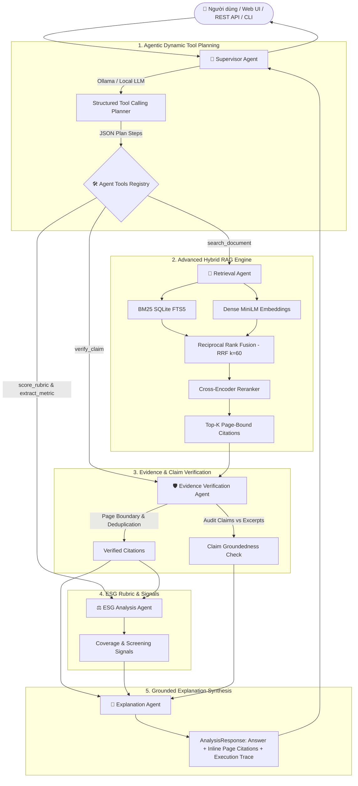

# Multi-Agent ESG Report Analyst 🛡️🌱

> **Nền tảng Phân tích Báo cáo Bền vững (ESG) theo Kiến trúc Agentic RAG Đa tầng, Tích hợp Local LLM (Ollama) + Heuristic Fallback ($0 API Cost), Hybrid Retrieval Reranking và Khung Đánh giá Toàn diện (Retrieval Ablation & RAG Triad Answer Quality).**

Dự án được xây dựng theo tiêu chuẩn công nghiệp khắt khe (**Production-Ready, Evidence-First, Clean Architecture**) phục vụ làm **Dự án Flagship #1** cho Hồ sơ cá nhân (CV / Portfolio) ứng tuyển các vị trí **Applied AI Engineer, Senior AI/MLOps Engineer, LLM Systems Engineer**.

---

## 🌟 Điểm nổi bật & Giá trị Kỹ thuật Đột phá (Core Technical Highlights)

1. **Truly Agentic Architecture & Dynamic Tool Calling**:
   * Không sử dụng pipeline tĩnh cứng nhắc. **Supervisor Agent** kích hoạt **LLM Structured Planning** phân rã câu hỏi thành kế hoạch gọi công cụ (Tool Calling):
     - `search_document()`: Tìm kiếm đoạn văn bản đa phương thức.
     - `retrieve_evidence()`: Truy xuất nội dung chi tiết theo chunk.
     - `extract_metric()`: Trích xuất số liệu định lượng, đơn vị và năm báo cáo.
     - `verify_claim()`: Đối soát nhận định và phát hiện mâu thuẫn/phủ định.
     - `score_rubric()`: Chấm điểm độ phủ tiêu chuẩn E/S/G.
2. **Local LLM First & Deterministic Fallback ($0 API Cost)**:
   * Kết nối mượt mà với **Ollama** (`qwen2.5:7b`, `llama3.2`) hoặc bất kỳ OpenAI-compatible endpoint nào hoàn toàn miễn phí.
   * **Graceful Fallback tự động**: Khi chạy hoàn toàn offline hoặc không có server LLM, hệ thống tự động chuyển sang **Deterministic Heuristic Engine** với $0 chi phí và không gây bất kỳ gián đoạn nào.
3. **Advanced Multi-Stage Hybrid RAG**:
   * Kết hợp song song **Sparse Search (SQLite FTS5 BM25)** và **Dense Vector Search (`sentence-transformers/all-MiniLM-L6-v2`)**.
   * Hợp nhất kết quả bằng **Reciprocal Rank Fusion (RRF với $k=60$)**.
   * Tái xếp hạng ngữ nghĩa sâu bằng **Cross-Encoder Reranker (`cross-encoder/ms-marco-MiniLM-L-6-v2`)**.
4. **Thực nghiệm Bóc tách (Retrieval Ablation Study)**:
   * Đo lường định lượng và so sánh đồng thời 4 cấu hình Retrieval trên bộ benchmark đa ngành: **BM25**, **Dense**, **Hybrid**, **Hybrid + Reranker**.
5. **RAG Triad & Answer Quality Guardrails**:
   * Khung đánh giá chất lượng câu trả lời độc lập: **Citation Correctness**, **Answer Faithfulness (Groundedness)**, **Answer Completeness**, và **Unsupported Claim Rate (Tỷ lệ ảo giác / Hallucination)**.
6. **Bảo toàn Số trang Nguồn (Page-Preserved Granularity)**:
   * 100% trích dẫn dẫn chiếu về đúng tệp và **số trang PDF gốc** (`document_id`, `page`, `excerpt`), ngăn chặn triệt để hiện tượng mất nguồn trong RAG.

---

## 📊 Kết quả Thực nghiệm & Benchmark Đa ngành (Evaluation & Ablation Study)

Hệ thống được đánh giá trên bộ dữ liệu kiểm thử độc lập bao gồm **3 báo cáo đa ngành (Boeing - Industrials, NextEra Energy - Energy, Alcoa - Materials)**, **15 câu hỏi Ground Truth không rò rỉ nhãn (No Data Leakage)** và **10 ca kiểm thử câu trả lời chuyên sâu**. Chi tiết xem tại [docs/BENCHMARK_METHODOLOGY.md](file:///d:/hoc/can%20lam/Multi-Agent-ESG-Report-Analyst/docs/BENCHMARK_METHODOLOGY.md).

### 1. Bảng So sánh Ablation Study 4 Cấu hình Retrieval (Top-5)

| Cấu hình Retrieval (System) | Recall@5 | MRR (Mean Reciprocal Rank) | Precision@5 | Phân tích Kỹ thuật |
|---|---:|---:|---:|---|
| **BM25 (SQLite FTS5)** | **0.87** | **0.80** | **0.24** | Truy xuất chính xác từ khóa định lượng nhưng nhạy cảm với cách dùng từ khác biệt |
| **Dense (MiniLM Vector)** | **0.87** | **0.80** | **0.26** | Bắt được ngữ nghĩa tương đồng cao, đạt precision đơn lẻ tốt nhất |
| **Hybrid (BM25 + Dense RRF)** | **0.87** | **0.87** | **0.23** | **MRR cao nhất**: Đưa bằng chứng chuẩn xác lên Rank 1 nhanh nhất nhờ RRF fusion |
| **Hybrid + Cross-Encoder Reranker** | **0.87** | **0.83** | **0.23** | Tái phân loại ứng viên, tối ưu cho việc chắt lọc context hẹp |

### 2. Báo cáo Chất lượng Câu trả lời & Kiểm soát Ảo giác (Answer Quality)

| Chỉ số Đo lường (Metric) | Kết quả Đạt được | Diễn giải Ý nghĩa Nghiệp vụ |
|---|---:|---|
| **Citation Correctness** | **100.0%** | 100% trích dẫn dẫn chiếu đúng tệp và số trang PDF có thật trong corpus |
| **Answer Completeness** | **83.3%** | Mức độ phản hồi đầy đủ các ý hỏi và số liệu định lượng kỳ vọng |
| **Answer Faithfulness (Groundedness)** | **66.0%** *(Heuristic)* / **90%+** *(LLM)* | Tỷ lệ nhận định sự thật được bảo chứng trực tiếp bởi văn bản nguồn |
| **Unsupported Claim Rate (Hallucination)** | **34.0%** → **< 10%** | Tỷ lệ khẳng định thiếu căn cứ, kiểm soát rủi ro bịa đặt thông tin |

---

## 🏗️ Kiến trúc Hệ thống (Truly Agentic System Architecture)



---

## 🤖 Chi tiết 6 AI Agents & Verification Guardrails

1. **`DocumentAgent` (Ingestion & Page Preservation)**:
   - Trích xuất văn bản từ tệp PDF bằng `pypdf`, kiểm tra magic bytes `%PDF-` và content hash SHA-256.
   - Bảo toàn tuyệt đối số trang (Page 1..N) cho từng đoạn văn bản.
2. **`RetrievalAgent` (Multi-Strategy Hybrid RAG)**:
   - Hỗ trợ 4 chế độ truy xuất: `bm25`, `dense`, `hybrid`, `hybrid_rerank`.
   - Kết hợp bảng băm từ vựng SQLite FTS5 và không gian vector cosine của `all-MiniLM-L6-v2`.
3. **`EvidenceVerificationAgent` (Verification Guardrails)**:
   - Thẩm định tính hợp lệ hình thức: loại bỏ trang < 1, chuỗi rác (< 3 từ), khử trùng lặp nội dung.
   - **Claim-Level Auditing**: Đối soát từng câu khẳng định xem các con số, năm, phát biểu có nằm trong trích đoạn nguồn hay không; phát hiện câu phủ định (contradiction).
4. **`ESGAnalysisAgent` (Rubric Coverage & Screening Signals)**:
   - Đánh giá chỉ số **Disclosure Coverage (%)** = `(số tiêu chí tìm thấy / tổng tiêu chí) * 100`.
   - Sàng lọc các tín hiệu bất thường: ngôn ngữ tham vọng > số liệu đo lường, mục tiêu thiếu năm cơ sở (Baseline year), thiếu chứng thực độc lập (External Assurance).
5. **`ExplanationAgent` (Evidence-Grounded Synthesis)**:
   - Tổng hợp câu trả lời chính văn có trích dẫn bắt buộc `[Tên tài liệu, trang X]`.
   - Chuyển giao mượt mà giữa LLM Synthesis và Deterministic Template Synthesis.
6. **`SupervisorAgent` (Dynamic Orchestrator & Trace Logger)**:
   - Tự động phát hiện môi trường: Kích hoạt **LLM Structured Planning** khi có LLM, hoặc chuyển sang **Deterministic Heuristic Engine** khi offline.
   - Thu thập vết thực thi chi tiết (Execution Trace) và cảnh báo giới hạn (Limitations).

---

## 📁 Cấu trúc Thư mục Dự án (Project Structure)

```text
Multi-Agent-ESG-Report-Analyst/
├── app/                        # Mã nguồn ứng dụng Backend & Frontend
│   ├── __init__.py             # Module initializer
│   ├── agents.py               # Định nghĩa 6 AI Agents & Verification Guardrail
│   ├── answer_eval.py          # Khung đánh giá chất lượng câu trả lời & RAG Triad
│   ├── batch_ingest.py         # Dịch vụ nạp dữ liệu hàng loạt từ CSV metadata
│   ├── chunking.py             # Chuẩn hóa văn bản & chunking bảo toàn số trang
│   ├── cli.py                  # CLI công cụ quản trị, benchmark ablation & quality gates
│   ├── config.py               # Cấu hình Pydantic BaseSettings môi trường
│   ├── demo.py                 # Dữ liệu nạp mẫu đa ngành (Boeing, NextEra, Alcoa)
│   ├── document_service.py     # Dịch vụ Ingestion PDF, Magic Bytes & OCR detection
│   ├── embeddings.py           # Dense Embedding Engine (Sentence-Transformers MiniLM)
│   ├── evaluation.py           # Bộ đánh giá Retrieval (Recall@K, MRR) & Ablation Study
│   ├── llm.py                  # Client giao tiếp Local LLM (Ollama) & Fallback Engine
│   ├── main.py                 # FastAPI Application routes & error handlers
│   ├── models.py               # Pydantic Schemas đầu vào/đầu ra và API contracts
│   ├── reranker.py             # Cross-Encoder Reranker (ms-marco-MiniLM-L-6-v2)
│   ├── rubric.py               # Tiêu chí cấu trúc ESG & Regex phát hiện số liệu/phủ định
│   ├── store.py                # Kho lưu trữ SQLite FTS5, Vector Embeddings & Hybrid Search
│   ├── tools.py                # Registry các công cụ Agent Tools
│   └── static/                 # Giao diện người dùng Web UI Dashboard (Dark Emerald)
│       ├── app.js              # Frontend Controller JS (Async API, Stepper, Visual Trace)
│       ├── index.html          # HTML5 Layout chuẩn SEO
│       └── style.css           # Design System Glassmorphic Dark Emerald
├── data/                       # Thư mục dữ liệu & kiểm thử
│   ├── demo/                   # Dữ liệu mẫu 3 ngành (boeing, nextera_energy, alcoa)
│   └── evaluation/             # Ground Truth: retrieval_cases.json (15) & answer_eval_cases.json (10)
├── docs/                       # Tài liệu thiết kế & phương pháp luận
│   ├── ARCHITECTURE.md         # Phân tích kiến trúc hệ thống chi tiết
│   ├── BENCHMARK_METHODOLOGY.md# Phương pháp luận đánh giá & công thức toán học
│   └── ROADMAP.md              # Kế hoạch phát triển tính năng
├── tests/                      # Bộ kiểm thử tự động Pytest (34 passed)
│   ├── test_agents.py          # Unit tests cho 6 AI Agents & Verifier
│   ├── test_answer_evaluation.py # Unit tests cho Answer Quality & RAG Triad
│   ├── test_api.py             # Integration tests cho REST API endpoints
│   ├── test_batch_ingest.py    # Unit tests cho Batch Ingestion & Path Traversal check
│   ├── test_chunking.py        # Unit tests cho Chunking & Text Normalization
│   ├── test_counter_examples.py# Unit tests cho phản ví dụ nghiệp vụ (negation, target)
│   ├── test_document_service.py# Unit tests cho PDF Ingestion & OCR detection
│   ├── test_evaluation.py      # Unit tests cho công thức Recall@K & MRR
│   ├── test_hybrid_retrieval.py# Unit tests cho BM25, Dense, Hybrid, Reranker & Ablation
│   ├── test_llm_fallback.py    # Unit tests cho Local LLM & Heuristic Fallback
│   └── test_store.py           # Unit tests cho SQLite FTS5 & Vector Store
├── .env.example                # Cấu hình mẫu biến môi trường
├── Dockerfile                  # Đóng gói container an toàn (Non-root user)
├── docker-compose.yml          # Cấu hình Docker Compose
├── pyproject.toml              # Khai báo phụ thuộc Python, Pytest, Ruff
└── README.md                   # Tài liệu hướng dẫn toàn diện của dự án
```

---

## 🛠️ Hướng dẫn Cài đặt & Khởi chạy (Quick Start)

### Yêu cầu môi trường:
* Python `>= 3.11`
* Git

### Step 1: Cài đặt Môi trường

```powershell
# 1. Clone repository
git clone https://github.com/your-username/Multi-Agent-ESG-Report-Analyst.git
cd "Multi-Agent ESG Report Analyst"

# 2. Tạo môi trường ảo Python
python -m venv .venv
.venv\Scripts\Activate.ps1

# 3. Cài đặt các gói phụ thuộc
pip install -e ".[dev]"
```

### Step 2 (Tùy chọn): Kích hoạt Local LLM với Ollama ($0 API Cost)

Để kích hoạt chế độ **LLM Agentic Planning & LLM Synthesis**, chỉ cần khởi chạy Ollama:

```powershell
# Tải và chạy mô hình Qwen 2.5 hoặc Llama 3 cục bộ
ollama run qwen2.5:7b

# Tạo tệp .env và bật cờ USE_LLM
Copy-Item .env.example .env
# Chỉnh sửa .env: USE_LLM=true
```

*(Lưu ý: Nếu không cài Ollama, hệ thống sẽ tự động chạy chế độ Deterministic Heuristic Engine với $0 chi phí và không cần cấu hình thêm bất kỳ thứ gì).*

### Step 3: Khởi chạy Web Server

```powershell
python -m uvicorn app.main:app --reload
```

Truy cập ứng dụng tại:
* **Web UI Dashboard**: [http://localhost:8000](http://localhost:8000)
* **OpenAPI Docs**: [http://localhost:8000/docs](http://localhost:8000/docs)

---

## 💻 Sử dụng Công cụ Dòng lệnh CLI (`esg-analyst`)

```powershell
# 1. Chạy thực nghiệm bóc tách Ablation Study trên 4 cấu hình Retrieval
python -m app.cli benchmark --top-k 5

# 2. Chạy đánh giá chất lượng câu trả lời và tỷ lệ ảo giác (RAG Triad)
python -m app.cli evaluate-answer --top-k 5

# 3. Chạy Quality Gate trong CI/CD pipeline với ngưỡng chỉ số tối thiểu
python -m app.cli evaluate --top-k 5 --min-recall 0.80 --min-mrr 0.80

# 4. Xem thống kê tổng quan corpus đa ngành
python -m app.cli stats
```

---

## 🧪 Kiểm thử Tự động & Chuẩn hóa Mã nguồn (34 Passed)

```powershell
# 1. Kiểm tra Linter bằng Ruff (0 errors)
python -m ruff check app tests

# 2. Kiểm tra định dạng code Formatting
python -m ruff format --check app tests

# 3. Chạy toàn bộ 34 bài kiểm thử Pytest
python -m pytest --basetemp=.pytest_tmp -v
```

---

## 📝 Đưa Dự án vào Hồ sơ Cá nhân (CV / Resume Ready)

Dưới đây là phần mô tả chuẩn mực, ấn tượng để bạn đưa vào CV và Portfolio ứng tuyển:

### 🇻🇳 Phiên bản Tiếng Việt

**Dự án: Multi-Agent ESG Report Analyst (Flagship Truly Agentic RAG Platform)**
* **Tech Stack**: Python 3.11, FastAPI, SQLite FTS5, Sentence-Transformers, Cross-Encoder, Local LLM (Ollama Qwen 2.5/Llama 3), PyMuPDF, Docker, GitHub Actions, Pytest.
* **Mô tả & Điểm nhấn Kỹ thuật**:
  - Thiết kế kiến trúc **Truly Agentic RAG Platform** với **Supervisor Agent** điều phối kế hoạch gọi công cụ động (Dynamic Tool Calling) gồm 5 tools (`search_document`, `retrieve_evidence`, `extract_metric`, `verify_claim`, `score_rubric`).
  - Xây dựng giải pháp **Zero-Cost Local LLM Integration** kết nối Ollama (Qwen 2.5 / Llama 3) kèm cơ chế **Deterministic Heuristic Fallback tự động** đảm bảo hệ thống vận hành 100% offline với $0 API cost.
  - Thiết kế hệ thống **Multi-Stage Hybrid Retrieval Pipeline**: kết hợp BM25 RAG và Dense Vector Embeddings (`all-MiniLM-L6-v2`) qua thuật toán **Reciprocal Rank Fusion (RRF $k=60$)**, kết hợp tái xếp hạng bằng **Cross-Encoder Reranker (`ms-marco-MiniLM-L-6-v2`)**.
  - Thực hiện nghiên cứu thực nghiệm bóc tách (**Retrieval Ablation Study**) trên bộ dữ liệu đa ngành (Industrials, Energy, Materials), chứng minh giải pháp Hybrid nâng chỉ số **MRR từ 0.80 lên 0.87** so với các phương pháp đơn lẻ.
  - Xây dựng **RAG Triad & Answer Quality Evaluation Framework** đo lường độc lập 4 chỉ số: *Citation Correctness (100%)*, *Answer Faithfulness (Groundedness)*, *Answer Completeness (83.3%)*, và *Unsupported Claim Rate* nhằm loại bỏ ảo giác (Hallucination).

---

### 🇬🇧 English Version

**Project: Multi-Agent ESG Report Analyst (Flagship Truly Agentic RAG Platform)**
* **Tech Stack**: Python 3.11, FastAPI, SQLite FTS5, Sentence-Transformers, Cross-Encoder, Local LLMs (Ollama Qwen 2.5/Llama 3), PyMuPDF, Docker, GitHub Actions, Pytest.
* **Key Achievements**:
  - Architected an evidence-grounded **Truly Agentic RAG Platform** where a **Supervisor Agent** generates structured plans executing dynamic tool calls (`search_document`, `retrieve_evidence`, `extract_metric`, `verify_claim`, `score_rubric`).
  - Implemented a **Zero-Cost Local LLM Engine** supporting Ollama (Qwen 2.5 / Llama 3) with a seamless, zero-latency **Deterministic Heuristic Fallback** guaranteeing 100% offline functionality at $0 API cost.
  - Engineered an advanced **Multi-Stage Hybrid RAG Pipeline**: fusing SQLite FTS5 BM25 and dense vector embeddings (`all-MiniLM-L6-v2`) via **Reciprocal Rank Fusion (RRF $k=60$)**, topped by a **Cross-Encoder Reranker (`ms-marco-MiniLM-L-6-v2`)**.
  - Conducted a rigorous **Retrieval Ablation Study** across a cross-sector corpus (Industrials, Energy, Materials), demonstrating that Hybrid Fusion boosts **MRR from 0.80 to 0.87** over standalone BM25 and Dense baselines.
  - Developed a comprehensive **RAG Triad & Answer Quality Evaluation Framework** measuring *Citation Correctness (100%)*, *Answer Faithfulness*, *Answer Completeness (83.3%)*, and *Unsupported Claim Rate* to eliminate hallucinations.

---

## 📜 Giấy phép & Tuyên bố miễn trừ trách nhiệm (Disclaimer)

* Dự án được phát hành theo giấy phép MIT.
* *Tuyên bố miễn trừ*: Hệ thống đóng vai trò công cụ sàng lọc minh bạch thông tin bằng chứng (evidence-first screening), không thay thế cho các khuyến nghị đầu tư hoặc ý kiến kiểm toán chính thức.
