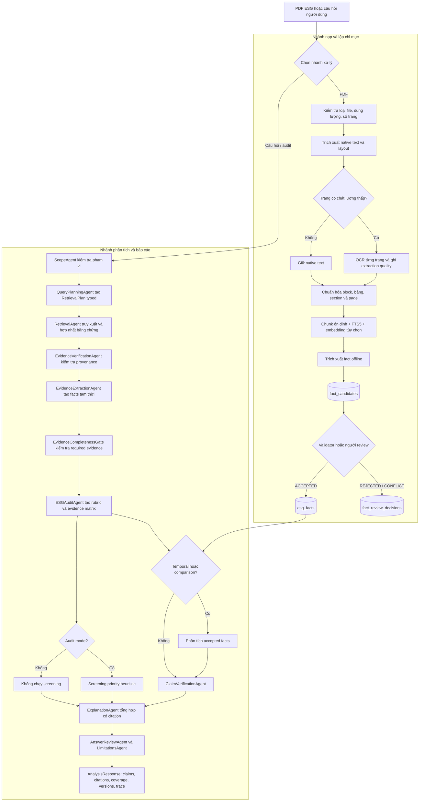

# Multi-Agent ESG Report Analyst — Evidence-Grounded ESG Intelligence


Nền tảng local-first để phân tích báo cáo ESG theo nguyên tắc **evidence-first**. Mọi số liệu, nhận định và tín hiệu sàng lọc đều phải truy ngược được về tài liệu, trang PDF, chunk ổn định và `evidence_id`. Hệ thống có thể chạy deterministic hoàn toàn, hoặc dùng local LLM khi được bật.

## Bài toán và phạm vi ứng dụng

Doanh nghiệp thường công bố ESG trong các PDF dài, nhiều bảng, nhiều cách gọi chỉ tiêu và nhiều năm báo cáo. Việc đọc thủ công khó bảo đảm rằng một con số trong câu trả lời đúng với trang nguồn, đúng năm và đúng phạm vi tài liệu.

Dự án giải quyết quy trình đó bằng cách:

- lập chỉ mục báo cáo PDF, giữ metadata bố cục, trang và chất lượng trích xuất;
- truy xuất bằng BM25, dense hoặc hybrid/rerank;
- kiểm tra citation trước khi dùng làm bằng chứng;
- trích xuất fact có cấu trúc và tách `fact_candidate` khỏi `esg_fact` đã duyệt;
- audit công bố theo rubric `climate-disclosure-v1`;
- phân tích temporal/comparison chỉ trên accepted facts;
- trả về câu trả lời có claims, citations, độ đầy đủ, giới hạn và trace agent.

Phạm vi hiện tại là **screening và phân tích bằng chứng trong corpus đã index**. Kết quả greenwashing chỉ là tín hiệu ưu tiên kiểm tra, không phải xác suất, kết luận pháp lý, kết luận gian lận hay kiểm toán độc lập.

## Quy trình kỹ thuật duy nhất

Đây là luồng canonical chi phối cách nạp tài liệu, lưu fact, truy vấn, audit và tạo báo cáo. Các API, CLI và dashboard đều gọi vào cùng các lớp service/workflow này.



Quy tắc quan trọng của luồng:

1. `fact_candidates` là dữ liệu chờ duyệt, không được coi là sự thật canonical.
2. Chỉ fact có quyết định `ACCEPTED` mới được dùng mặc định cho temporal và comparison.
3. Citation phải còn trong scope, có trang hợp lệ và có excerpt trước khi gắn vào claim.
4. Thiếu bằng chứng không bị biến thành kết luận chắc chắn; hệ thống ghi `partial`/`missing` và đưa vào `limitations`.
5. Screening chỉ chạy trong `audit` và luôn có disclaimer về tính heuristic.

## Hướng agent

README chỉ giữ route khái quát để dễ đọc:

```text
Question / audit request
        ↓
Planner → Retrieval → Evidence verification
        ↓
Fact extraction + completeness gate
        ↓
ESG audit / accepted-fact analysis
        ↓
Claim verification → grounded answer
```

Graph đầy đủ, điều kiện rẽ nhánh, trách nhiệm của từng agent, giới hạn bước và các mode chạy được mô tả tại [docs/AGENT_GRAPH.md](docs/AGENT_GRAPH.md).

Agent chỉ điều phối và quyết định bước tiếp theo. PDF parsing, OCR, retrieval, extraction, validation, rubric và storage vẫn nằm trong các service deterministic để có thể kiểm thử và chạy offline.

## Fact lifecycle và provenance

Đây là điểm khác biệt chính của dự án so với một chatbot đọc PDF:

```text
PDF → chunk → fact_candidate → review
                         ├─ rejected
                         ├─ conflict
                         └─ accepted → esg_fact
                                      ↓
                         temporal / comparison / audit
```

Mỗi bằng chứng có thể truy theo chuỗi:

```text
Claim
  ↓
Evidence ID
  ↓
Document ID + tên tài liệu
  ↓
Page PDF + section + block
  ↓
Stable chunk
  ↓
Fact candidate hoặc accepted fact
```

Ví dụ trace tối giản:

```json
{
  "claim": "Scope 1 emissions: 12400 tCO2e in 2024",
  "evidence_id": "boeing-demo:p42:chunk-0007",
  "document_id": "boeing-demo",
  "page": 42,
  "section": "Climate metrics",
  "stable_chunk_id": "chunk-0007",
  "fact_id": "fact-...",
  "review_status": "ACCEPTED"
}
```

Các ID trong ví dụ là schematic; ID thực tế được trả trong `citations`, `claims`, `trace_steps` và các bảng SQLite.

## Cấu trúc thư mục

```text
Multi-Agent-ESG-Report-Analyst/
├─ app/
│  ├─ main.py                 FastAPI routes và lifespan
│  ├─ workflow.py             pipeline và supervisor workflow
│  ├─ agent_runtime.py        graph bounded, cycle detection, trace
│  ├─ models.py               Pydantic request/response contracts
│  ├─ store.py                SQLite, FTS5, documents, chunks, fact lifecycle
│  ├─ document_service.py      PDF/OCR, quality gate, indexing
│  ├─ capabilities/            planner, retrieval, verification, explanation
│  ├─ domain/                  rubric, evidence matrix, audit, screening
│  ├─ extraction/              ESG fact extraction và validators
│  ├─ facts/repository.py      candidate/accepted fact repository
│  ├─ evaluation.py            retrieval và structured extraction metrics
│  ├─ answer_eval.py           answer grounding metrics
│  └─ static/                  dashboard HTML/CSS/JavaScript
├─ data/
│  ├─ demo/                    excerpt dùng cho demo offline
│  └─ evaluation/              retrieval, answer và split dev/test
├─ rubrics/                    rubric YAML versioned
├─ docs/
│  ├─ AGENT_GRAPH.md           graph agent chi tiết
│  ├─ CORPUS_SNAPSHOT.yaml     snapshot cấu trúc corpus
│  └─ ...                      tài liệu kỹ thuật bổ sung
├─ tests/                      unit, API, workflow và lifecycle tests
├─ Dockerfile
├─ pyproject.toml
└─ README.md
```

SQLite runtime mặc định nằm ở `data/esg.db`. Database, cache và file build là artifact chạy thử, không phải source code cần commit.

## Cài đặt

Yêu cầu Python **3.11 trở lên**.

```powershell
git clone <repository-url>
cd Multi-Agent-ESG-Report-Analyst
python -m venv .venv
.\.venv\Scripts\Activate.ps1
python -m pip install --upgrade pip
pip install -e ".[dev]"
```

OCR cho PDF scan cần Tesseract trong `PATH`. `Dockerfile` đã cài Tesseract trong image. Nếu chỉ chạy corpus có native text, có thể dùng chế độ local deterministic mà không cần LLM.

## Cấu hình

Copy `.env.example` thành `.env` khi cần thay đổi mặc định:

| Biến | Mặc định | Ý nghĩa |
|---|---|---|
| `DATABASE_PATH` | `data/esg.db` | SQLite runtime |
| `TOP_K` | `6` | Số citation tối đa cho truy vấn thường |
| `MAX_FILE_SIZE` | `78643200` | Kích thước PDF tối đa, 75 MiB |
| `MAX_PDF_PAGES` | `500` | Giới hạn trang mỗi PDF |
| `USE_LLM` | `false` | Bật local LLM khi endpoint sẵn sàng |
| `LLM_BASE_URL` | `http://localhost:11434/v1` | Endpoint OpenAI-compatible |
| `LLM_MODEL` | `qwen2.5:7b` | Tên model local |
| `RETRIEVAL_MODE` | `hybrid` khi không đặt biến; `.env.example` dùng `hybrid_rerank` | `bm25`, `dense`, `hybrid` hoặc `hybrid_rerank` |
| `RRF_K` | `60` | Hằng số Reciprocal Rank Fusion |

Mặc định `USE_LLM=false`, vì vậy chạy thử không phụ thuộc API trả phí. Khi yêu cầu `agentic` nhưng LLM không sẵn sàng, workflow tự ghi mode fallback và vẫn chạy deterministic.

## Chạy ứng dụng

Khởi động API và dashboard:

```powershell
python -m uvicorn app.main:app --reload
```

Mở [http://localhost:8000](http://localhost:8000). Các endpoint chính:

| Method | Endpoint | Mục đích |
|---|---|---|
| `GET` | `/health` | Health check và corpus stats |
| `GET` | `/api/corpus/stats` | Số documents/chunks và thống kê corpus |
| `GET` | `/api/documents` | Danh sách tài liệu đã index |
| `POST` | `/api/documents` | Upload và index PDF |
| `POST` | `/api/search` | Tìm citation trực tiếp |
| `POST` | `/api/analyze` | Chạy workflow theo `mode` yêu cầu |
| `POST` | `/api/query` | Hỏi đáp evidence-grounded |
| `POST` | `/api/audit` | Audit disclosure và screening heuristic |
| `POST` | `/api/temporal` | Phân tích xu hướng trên accepted facts |
| `POST` | `/api/compare` | So sánh disclosure giữa các công ty |
| `GET` | `/api/documents/{id}/metrics` | Xem fact candidates của tài liệu |
| `PATCH` | `/api/v1/facts/{fact_id}` | `ACCEPTED`, `REJECTED` hoặc `CONFLICT` |
| `GET` | `/api/documents/{id}/audit` | Evidence matrix của tài liệu |
| `GET` | `/api/analysis/recent/trace` | Trace request gần nhất |

Chạy bằng Docker Compose:

```powershell
docker compose up --build
```

Container đã cài Tesseract OCR và copy rubric versioned cùng mã nguồn. Database runtime được mount từ thư mục `data/`.

Ví dụ duyệt fact candidate:

```http
PATCH /api/v1/facts/{fact_id}
Content-Type: application/json

{"status":"ACCEPTED","reviewed_by":"analyst@example.com"}
```

## Nạp dữ liệu và CLI

Nạp dataset PDF bên ngoài theo metadata CSV. Repository chỉ kèm demo excerpt, không kèm `metadata.csv` và thư mục PDF production:

```powershell
esg-analyst ingest --metadata C:\data\metadata.csv --reports-dir C:\data\reports
```

Các lệnh chính:

```powershell
esg-analyst stats
esg-analyst audit --agent-mode deterministic
esg-analyst compare --companies "Boeing,NextEra Energy,Alcoa"
esg-analyst evaluate
esg-analyst benchmark
esg-analyst evaluate-answer
esg-analyst evaluate-extraction
```

Nếu package chưa được cài editable, có thể gọi tương đương bằng `python -m app.cli ...`.

## Evaluation

Repo đã có bốn dòng đánh giá, không chỉ kiểm tra xem pipeline có chạy hay không:

| Nhóm | Chỉ số hiện có | Lệnh |
|---|---|---|
| Retrieval | `Recall@K`, `MRR`, `Precision@K`, `nDCG@K` | `esg-analyst evaluate` |
| Retrieval ablation | BM25, Dense, Hybrid, Hybrid + Reranker | `esg-analyst benchmark` |
| Structured extraction | exact match, numeric tolerance, unit accuracy, year accuracy | `esg-analyst evaluate-extraction` |
| Answer grounding | faithfulness, citation correctness, completeness, unsupported claim rate, gold citation precision/recall | `esg-analyst evaluate-answer` |

Kết quả lệnh được in dưới dạng JSON để lưu artifact hoặc dùng trong CI. Không ghi cứng benchmark score vào README vì score phụ thuộc corpus, model và cấu hình tại thời điểm chạy. Bộ test code là quality gate bổ sung:

```powershell
python -m ruff check app tests
python -m ruff format --check app tests
python -m pytest
```

## Corpus snapshot

Snapshot cấu trúc, nguồn sinh và các trường cần theo dõi nằm tại [docs/CORPUS_SNAPSHOT.yaml](docs/CORPUS_SNAPSHOT.yaml). Khi nạp corpus mới, cập nhật các trường `companies`, `reports`, `pages`, `chunks`, `candidate_facts`, `accepted_facts` và `years` bằng số liệu từ `/api/corpus/stats` cùng các bảng fact trong SQLite.

## Giới hạn và cách diễn giải kết quả

- Phân tích chỉ dựa trên các tài liệu đã index; hệ thống không tự xác minh độc lập báo cáo của doanh nghiệp.
- Fact extraction tạo candidate; analyst hoặc validator phải duyệt trước khi dùng cho temporal/comparison.
- Coverage đo mức độ có bằng chứng trong corpus, không đo hiệu quả ESG thực tế của doanh nghiệp.
- Rubric mặc định là `climate-disclosure-v1`; mở rộng Social/Governance cần rubric và validator tương ứng.
- Dense/rerank và local LLM là tùy chọn; khi không khả dụng, hệ thống fallback về deterministic retrieval/workflow.
- Greenwashing screening là **screening signal**, không phải xác suất hay kết luận pháp lý.

## Tài liệu liên quan

- [Agent graph chi tiết](docs/AGENT_GRAPH.md)
- [Corpus snapshot](docs/CORPUS_SNAPSHOT.yaml)
