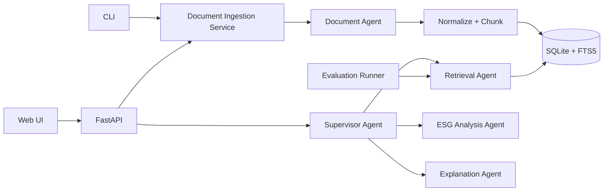
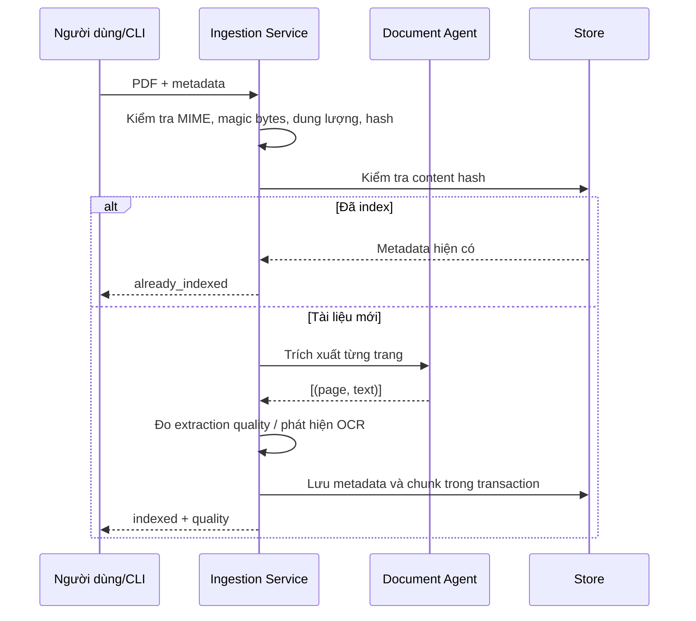

# Kiến trúc hệ thống

## Mục tiêu thiết kế

- Mọi kết luận phải truy ngược được về tài liệu và số trang.
- Logic nghiệp vụ không phụ thuộc FastAPI để có thể dùng lại trong CLI, worker hoặc test.
- Ingestion có thể chạy lại an toàn và bỏ qua nội dung đã index.
- Thành phần hạ tầng có thể được thay thế mà không sửa rubric ESG.

## Sơ đồ thành phần

## Luồng ingestion

## Luồng phân tích

1. Supervisor nhận câu hỏi và phạm vi tài liệu.
2. Retrieval Agent mở rộng truy vấn theo E/S/G.
3. Store chạy BM25; lexical fallback xử lý trường hợp FTS5 không khả dụng.
4. Evidence Validator loại citation rỗng, sai trang hoặc trùng lặp.
5. ESG Analysis Agent tính riêng disclosure, performance, evidence quality và confidence.
6. Explanation Agent chỉ diễn giải từ citation hợp lệ.

## Ranh giới module

| Module | Trách nhiệm |
|---|---|
| `main.py` | HTTP routing và ánh xạ lỗi |
| `document_service.py` | Use case ingestion PDF |
| `batch_ingest.py` | Điều phối ingestion theo metadata CSV |
| `agents.py` | Agent workflow và phân tích |
| `rubric.py` | Cấu hình tiêu chí ESG |
| `store.py` | Persistence và retrieval |
| `evaluation.py` | Chỉ số chất lượng retrieval |
| `cli.py` | Giao diện dòng lệnh |

## Lộ trình thay thế hạ tầng

- SQLite FTS5 → PostgreSQL/OpenSearch/Qdrant khi corpus và concurrency tăng.
- Xử lý đồng bộ → queue/worker khi PDF lớn hoặc chạy OCR.
- Rule-based analysis → LLM structured output sau khi citation validator đạt chuẩn.
- Local PDF → S3/MinIO trong môi trường staging và production.

