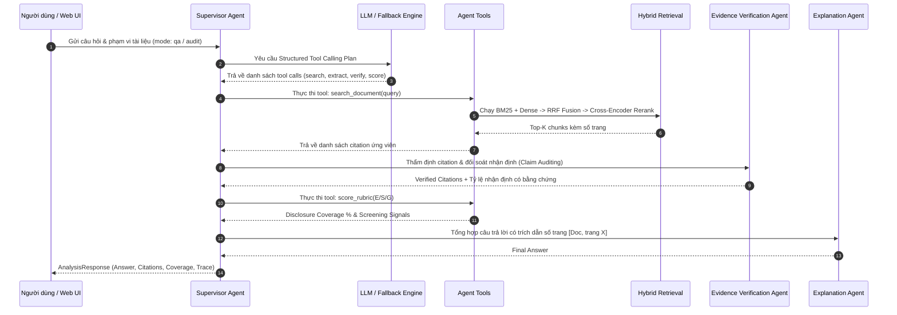

# Kiến trúc Hệ thống (System Architecture) - Multi-Agent ESG Report Analyst

## 1. Mục tiêu Thiết kế (Design Principles)

- **Evidence-First & Page-Preserved Granularity**: Mọi phân tích, trích xuất và kết luận đều phải truy ngược được về đúng tệp văn bản và số trang PDF gốc (`document_id`, `page`, `excerpt`).
- **Truly Agentic Planning & Dynamic Tool Execution**: Supervisor Agent không chạy pipeline cố định mà sử dụng LLM Structured Planning phân rã nhiệm vụ thành các lời gọi công cụ (Tool Calls) có kiểu dữ liệu rõ ràng.
- **$0 API Cost & Graceful Fallback**: Hỗ trợ Local LLM (Ollama: Qwen 2.5 / Llama 3) hoàn toàn miễn phí và tự động chuyển sang Deterministic Heuristic Engine khi offline mà không gây lỗi hoặc gián đoạn.
- **Advanced Multi-Stage Hybrid RAG**: Kết hợp điểm mạnh của tìm kiếm từ khóa chính xác (BM25 FTS5) và hiểu ngữ nghĩa sâu (Dense MiniLM Vectors), hợp nhất bằng Reciprocal Rank Fusion (RRF) và tinh chỉnh qua Cross-Encoder Reranker.
- **Dual Independent Evaluation**: Tách bạch kiểm định chất lượng truy xuất (Retrieval Ablation) và chất lượng sinh câu trả lời (Answer Quality & RAG Triad).

---

## 2. Sơ đồ Kiến trúc Tổng thể (Overall Architecture)

```mermaid
flowchart TD
    subgraph Client_Layer [Tầng Giao tiếp Client]
        UI["🌐 Modern Glassmorphic Web UI Dashboard"]
        CLI["💻 Administrative CLI Tool (esg-analyst)"]
    end

    subgraph API_Layer [Tầng API & Ingestion]
        API["⚡ FastAPI Server (app/main.py)"]
        ING["📥 Document Ingestion Service (app/document_service.py)"]
        DOC["📄 Document Agent (pypdf Page-Preserved Extraction)"]
    end

    subgraph Storage_Layer [Tầng Lưu trữ Đa mô thức (Store)]
        DB[("🗄️ SQLite Database (data/esg.db)
        • documents (Metadata & Quality)
        • chunks (Page-bound text)
        • chunks_fts (FTS5 BM25 Virtual Table)
        • chunk_embeddings (Vector JSON Store)")]
    end

    subgraph Agentic_Core [Tầng Agentic Core & Tool Execution]
        SUP["👔 Supervisor Agent (Dynamic Orchestrator)"]
        LLM["🤖 Local LLM Client (Ollama / Fallback Engine)"]
        TOOLS["🛠️ Agent Tools Registry (app/tools.py)"]
        RET["🔎 Retrieval Agent (Hybrid RAG + Reranking)"]
        VER["🛡️ Evidence Verification Agent (Claims Auditing)"]
        ESG["⚖️ ESG Analysis Agent (Rubric Coverage Scorer)"]
        EXP["📝 Explanation Agent (Grounded Synthesis)"]
    end

    subgraph Evaluation_Suite [Tầng Đánh giá Chất lượng MLOps]
        RET_EVAL["📊 Retrieval Ablation Runner (BM25 / Dense / Hybrid / Reranker)"]
        ANS_EVAL["🎯 Answer Quality Evaluator (Faithfulness, Citation, Hallucination)"]
    end

    UI --> API
    CLI --> ING
    CLI --> RET_EVAL
    CLI --> ANS_EVAL

    API --> ING
    ING --> DOC
    DOC --> DB

    API --> SUP
    SUP <--> LLM
    SUP --> TOOLS
    TOOLS --> RET
    RET --> DB
    TOOLS --> VER
    TOOLS --> ESG
    SUP --> EXP
    EXP --> FinalResp[AnalysisResponse + Page Citations + Trace]

    RET_EVAL --> RET
    ANS_EVAL --> SUP
```

---

## 3. Luồng Phân tích Agentic (Execution Workflow)



---

## 4. Ranh giới Phân chia Module (Module Boundaries)

| Module | Tệp nguồn | Trách nhiệm chính |
|---|---|---|
| **API Server** | `app/main.py` | Routing HTTP, upload PDF theo block, xử lý ngoại lệ chuẩn hóa |
| **Ingestion** | `app/document_service.py` | Kiểm tra Magic Bytes `%PDF-`, SHA-256 hash, OCR detection |
| **Agentic Core** | `app/agents.py` | 6 AI Agents & Verification Guardrails |
| **Agent Tools** | `app/tools.py` | Registry 5 công cụ chuẩn hóa cho Agentic Tool Calling |
| **Local LLM** | `app/llm.py` | Kết nối Ollama, sinh Structured JSON, auto-fallback deterministic |
| **Dense Vectors** | `app/embeddings.py` | Sentence-Transformers `all-MiniLM-L6-v2` & offline vector hashing |
| **Reranker** | `app/reranker.py` | Cross-Encoder `ms-marco-MiniLM-L-6-v2` & lexical proximity fallback |
| **Persistence** | `app/store.py` | SQLite FTS5 BM25, lưu trữ embeddings, Hybrid search (RRF $k=60$) |
| **Rubric** | `app/rubric.py` | Tiêu chí chuẩn E/S/G, Regex số liệu và nhận diện câu phủ định |
| **Retrieval Eval**| `app/evaluation.py` | Đo lường Recall@K, MRR, Precision@K & chạy Ablation Study |
| **Answer Eval** | `app/answer_eval.py` | RAG Triad: Faithfulness, Citation Correctness, Hallucination Rate |
| **CLI Tool** | `app/cli.py` | Giao diện dòng lệnh quản trị, nạp dữ liệu và quality gates |
