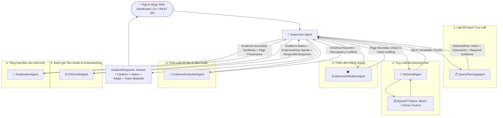

# Kiến trúc Hệ thống (System Architecture)
## Evidence-Grounded ESG Intelligence & Audit System

---

## 1. Mục tiêu và Nguyên tắc Thiết kế (Architectural Principles)

1. **Evidence-First & Deep Provenance**: Mọi khẳng định, điểm số và số liệu trích xuất đều phải gắn liền với nguồn trích dẫn cụ thể theo định danh tài liệu, số trang PDF thực tế, tiêu đề phân mục (`section`) và khối nội dung (`block_id`).
2. **Offline-First & $0 API Cost**: Toàn bộ hệ thống chạy 100% độc lập không phụ thuộc vào các dịch vụ đám mây trả phí. Hỗ trợ Local LLM (Ollama: Qwen 2.5 / Llama 3) và cơ chế tự động chuyển đổi sang **Deterministic Heuristic Engine** khi offline.
3. **Pluggable Storage Abstraction**: Giao diện `RetrievalStore` tách rời tầng nghiệp vụ khỏi cơ sở dữ liệu vật lý. Mặc định sử dụng `SQLiteFTSStore` với SQLite FTS5 (BM25) và Vector JSON embeddings, dễ dàng mở rộng sang Qdrant/PostgreSQL pgvector.
4. **Multi-Stage Hybrid Retrieval & Semantic Diversification**: Kết hợp sức mạnh của tìm kiếm từ khóa chính xác (BM25) và ngữ nghĩa đa chiều (Dense Embeddings), hợp nhất bằng **Reciprocal Rank Fusion (RRF $k=60$)**, tinh chỉnh bằng **Cross-Encoder Reranker**, và khử trùng lặp trang bằng **Semantic Diversification**.
5. **Multi-Signal Greenwashing Risk Screening**: Đánh giá rủi ro tuyên bố bền vững theo 3 chiều độc lập: *Target Credibility*, *Evidence Quality*, và *Narrative Risk*. Luôn dán nhãn rõ ràng là chỉ số sàng lọc (Screening Risk) nhằm hỗ trợ chuyên gia đối soát.
6. **Observability & Latency Waterfall**: Đo lường và ghi nhận chi tiết thời gian xử lý (latency ms) và số lượng trích đoạn qua từng Agent phục vụ theo dõi hiệu năng.

---

## 2. Kiến trúc 5 Lớp Chức năng (5-Layer Architecture)

```
┌────────────────────────────────────────────────────────────────────────┐
│                      Lớp 1: Document Intelligence                       │
│  PDF -> Page Classifier (Native Text / Table / Scanned / Mixed)         │
│  -> PyMuPDF / pypdf Parser -> Layout Blocks (Heading / Text / Table)   │
└───────────────────────────────────┬────────────────────────────────────┘
                                    │
                                    ▼
┌────────────────────────────────────────────────────────────────────────┐
│                   Lớp 2: Hybrid Retrieval & Reranking                   │
│  Contextual Chunking -> SQLite FTS5 (BM25) + Dense MiniLM Embeddings   │
│  -> Reciprocal Rank Fusion (RRF k=60) -> Cross-Encoder Reranker        │
│  -> Semantic & Page Diversification                                    │
└───────────────────────────────────┬────────────────────────────────────┘
                                    │
                                    ▼
┌────────────────────────────────────────────────────────────────────────┐
│       Lớp 3: Structured ESG Fact Extraction & Conflict Detection        │
│  Regex & Heuristic Extraction (Scope 1/2/3, Targets, TRIR, Diversity)  │
│  -> Unit Normalization (tCO2e, MWh, %) -> Conflict Detection           │
└───────────────────────────────────┬────────────────────────────────────┘
                                    │
                                    ▼
┌────────────────────────────────────────────────────────────────────────┐
│                       Lớp 4: Agentic ESG Analysis                      │
│  Evidence Matrix Generation -> Multi-Signal Greenwashing Radar         │
│  -> Temporal Trend Analysis (YoY) -> Cross-Company Comparison          │
└───────────────────────────────────┬────────────────────────────────────┘
                                    │
                                    ▼
┌────────────────────────────────────────────────────────────────────────┐
│                Lớp 5: Audit, QA, Observability & Provenance            │
│  Grounded Explanation Synthesis -> Page Provenance Citation Binding    │
│  -> Supervisor Trace Logs -> Latency Waterfall (ms per Agent)          │
└────────────────────────────────────────────────────────────────────────┘
```

---

## 3. Hệ thống 7 AI Agents & Supervisor Orchestrator



### Nhiệm vụ Chi tiết của Từng Agent:

| Agent | Lớp phụ trách | Nhiệm vụ nghiệp vụ chính |
|---|---|---|
| **`DocumentIntelligenceAgent`** | Lớp 1 | Phân tích bố cục trang PDF, phân loại trang (`scanned_image`, `table`, `mixed_page`, `native_text`), trích xuất các khối layout (`heading`, `text`, `table`). |
| **`QueryPlanningAgent`** | Lớp 2 | Phân rã câu hỏi tự nhiên phức tạp thành `RetrievalPlan`: xác định `intent` (`fact_lookup`, `criterion_audit`, `cross_document_compare`, `greenwashing_screening`, `temporal_trend`), sinh subqueries đa chiều và xác định bằng chứng bắt buộc. |
| **`RetrievalAgent`** | Lớp 2 | Thực thi truy xuất Hybrid (BM25 + Dense MiniLM), áp dụng công thức RRF $k=60$, tái xếp hạng bằng Cross-Encoder và đa dạng hóa trang để tránh trùng lặp. |
| **`EvidenceVerificationAgent`** | Lớp 3 | Thẩm định tính toàn vẹn của trích dẫn (số trang hợp lệ, trích đoạn có thật, không rỗng), đối soát các nhận định với nội dung gốc để chống ảo giác (Claim Auditing). |
| **`EvidenceExtractionAgent`** | Lớp 3 | Trích xuất các số liệu định lượng có cấu trúc (`ESGFact`), chuẩn hóa đơn vị đo lường quốc tế (`metric tons CO2e`, `%`, `hours`), và phát hiện bất đồng số liệu (`detect_conflicts`). |
| **`ESGAuditAgent`** | Lớp 4 | Đối soát từng tiêu chí chuẩn mực GRI/SASB sinh ra **Evidence Matrix**, sàng lọc rủi ro Greenwashing 3 chiều, phân tích chuỗi thời gian YoY và so sánh chéo giữa các doanh nghiệp. |
| **`ExplanationAgent`** | Lớp 5 | Tổng hợp câu trả lời hoặc báo cáo kiểm toán có dẫn nguồn chính xác theo từng trang và đề mục, hỗ trợ linh hoạt giữa LLM và Deterministic Synthesis. |
| **`SupervisorAgent`** | Điều phối | Điều phối tuần tự qua 7 agent, đo lường độ trễ thực thi (latency ms) từng bước và đóng gói thành `AnalysisResponse` hoàn chỉnh. |

---

## 4. Công thức Truy xuất & Hợp nhất Hybrid (Hybrid Retrieval Formula)

### 4.1. Reciprocal Rank Fusion (RRF)
Mỗi đoạn trích dẫn được xếp hạng song song bởi BM25 ($R_{\text{bm25}}$) và Dense Vector ($R_{\text{dense}}$). Điểm số RRF tổng hợp được tính theo công thức:

$$\text{Score}_{\text{RRF}}(d) = \frac{1}{k + R_{\text{bm25}}(d)} + \frac{1}{k + R_{\text{dense}}(d)} \quad (k = 60)$$

### 4.2. Cross-Encoder Reranking
Tập ứng viên Top-K từ RRF được chấm điểm tương đồng ngữ cảnh sâu bởi mô hình Cross-Encoder:

$$\text{Score}_{\text{final}}(q, d) = 0.5 \cdot \text{Score}_{\text{RRF}}(d) + 0.5 \cdot \text{Score}_{\text{CrossEncoder}}(q, d)$$

Khi chạy offline không có PyTorch/Transformers, hệ thống sử dụng thuật toán **Lexical Proximity & Topic Overlap Fallback** đảm bảo $0 cost và zero dependency failure.

### 4.3. Semantic & Page Diversification
Để tránh việc các đoạn trích dẫn của cùng một trang chiếm toàn bộ Top-K kết quả, thuật toán `_diversify_results` giới hạn tối đa 2 trích đoạn trên cùng một trang, ưu tiên mở rộng sang các trang và tài liệu khác trong corpus.

---

## 5. Cấu trúc Cơ sở Dữ liệu & Bảng Lưu trữ (SQLite FTS5 Storage)

Cơ sở dữ liệu SQLite tại `data/esg.db` được thiết kế với cơ chế tự động di chuyển lược đồ (Auto-Migration):

1. **`documents`**:
   - `id` (TEXT, PK): Định danh duy nhất (SHA-256 hash của tệp).
   - `name` (TEXT): Tên tệp báo cáo PDF.
   - `company` (TEXT), `year` (INTEGER): Siêu dữ liệu doanh nghiệp và năm phát hành.
   - `page_count` (INTEGER), `extraction_quality` (REAL): Số trang và chất lượng trích xuất text.
2. **`chunks`**:
   - `id` (INTEGER, PK AUTOINCREMENT): Mã chunk.
   - `document_id` (TEXT, FK): Khóa ngoại liên kết `documents`.
   - `page` (INTEGER): Số trang PDF gốc (1-indexed).
   - `text` (TEXT): Nội dung văn bản của đoạn trích.
   - `section_title` (TEXT): Tiêu đề phân mục trích xuất.
   - `block_type` (TEXT): Loại khối (`text` hoặc `table`).
   - `block_id` (TEXT): Định danh khối nội dung.
   - `pillar` (TEXT): Trụ cột ESG liên quan (`E`, `S`, `G`).
3. **`chunks_fts`** (FTS5 Virtual Table):
   - Virtual table lập chỉ mục toàn văn bản (Full-Text Search) hỗ trợ BM25 ranking tốc độ cao trên cột `text`.
4. **`chunk_embeddings`**:
   - `chunk_id` (INTEGER, PK): Khóa ngoại trỏ về `chunks`.
   - `embedding` (TEXT): Vector đặc trưng biểu diễn dưới dạng JSON mảng float.
